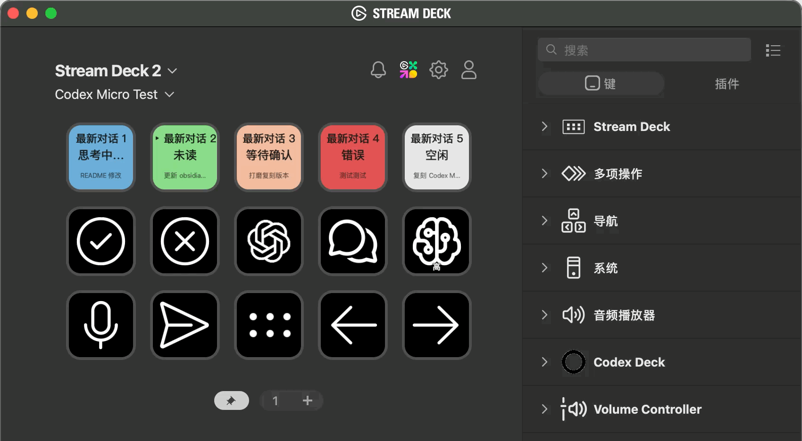

# Codex Deck

[English](README.md) · **简体中文**

> 把 OpenAI 的 **Codex Micro** 核心功能，复刻到一台普通 **15 键 Stream Deck**（5×3）上：实时 Agent 状态、批准/拒绝、发送、新建对话、推理等级、按住说话与页面切换。

<div align="center">


</div>


## 目录

- [快速开始](#快速开始)
- [这是什么](#这是什么)
- [按键布局](#按键布局随插件捆绑的-profile)
- [按键说明](#按键说明)
- [功能对照](#功能对照)
- [图标说明](#图标说明)
- [环境要求](#环境要求)
- [安装](#安装)
- [状态颜色](#状态颜色)
- [协议](#协议)
- [鸣谢](#鸣谢)

## 快速开始

1. 安装预打包插件（零安装）或从源码构建——见[安装](#安装)。
2. 保持 Codex 桌面端运行并已登录。
3. 把桌面端「设置 → 键盘快捷键」对齐：⌘⌥A 批准、⌘⌥R 拒绝、⌘⌥S 发送、⌘⌥E 循环推理等级。（或按自己喜爱的快捷键修改）
4. 完成——5 个对话键实时显示最近的对话与状态；命令键处理批准/拒绝/发送/新对话；PTT 键触发你自己的按住说话服务。

## 这是什么

Codex Micro 是 OpenAI 第一款面向 Codex 智能体工作流的硬件：一排带实时状态的 Agent 键，加上批准、拒绝、发送等命令键和按住说话控制。
本项目用一台普通 Stream Deck 复刻这套核心体验，并且完全基于 Codex 的**官方本地控制通道**——不做 GUI 自动化、不逆向、不依赖任何云端服务。



效果：5 个 Agent 键实时显示最近的 Codex 对话（活跃的排在前面）及其状态——思考中… / 未读 / 等待确认 / 错误 / 空闲 / 未连接；一排命令键可一键批准或拒绝权限请求、发送、新建对话、循环切换推理等级。按键画面由插件自己渲染，带呼吸/闪烁动画，尽力贴近真机效果。

> ⚠️ 这是对一款硬件产品的独立、非官方复刻，与 OpenAI、Work Louder 均无关联。

## 按键布局（随插件捆绑的 profile）

profile 的第 1 页「Codex 控制台」：
```
┌──────────┬──────────┬──────────┬──────────┬──────────┐
│ 最新对话 1 │ 最新对话 2 │ 最新对话 3 │ 最新对话 4 │ 最新对话 5 │   实时对话键（插件动作）
├──────────┼──────────┼──────────┼──────────┼──────────┤
│ Accept   │ Reject   │ ChatGPT   │ New Chat │ Reasoning│   ⌘⌥A / ⌘⌥R / 打开 ChatGPT 应用 / ⌘N / ⌘⌥E
├──────────┼──────────┼──────────┼──────────┼──────────┤
│ PTT      │ Send     │ 切换页面  │ 上个对话  │ 下个对话  │   ⌥Space / ⌘⌥S / 切换下一个 Profile / ⇧⌘[ / ⇧⌘]
└──────────┴──────────┴──────────┴──────────┴──────────┘
```

## 按键说明：
- **对话键（第一行）**——显示最近 5 个 Codex 对话及其实时状态（思考中… / 未读 / 等待确认 / 错误 / 空闲 / 未连接）。按一下即可跳转到桌面端对应对话，并把它设为命令键的操作对象
- Reasoning 键由插件和快捷键驱动，单击可以循环切换推理等级，同时显示当前推理等级，如「高」
- ChatGPT 徽标键直接打开桌面应用，长按关闭应用
- 其他按键触发原生快捷键动作（Accept / Reject / Send / New Chat）
- **PTT**——用配置的快捷键（默认为左 Option + 空格）触发你自己的第三方按住说话服务（如微信语音输入）
- **上个对话 / 下个对话**——桌面端里的对话切换

> Profile 里绑定的快捷键并非 ChatGPT 应用的默认快捷键，如果需要使用插件里附带的 profile，建议按照布局图所示修改默认的动作快捷键，或者在 Stream Deck 官方软件中自行修改 Profile 中各按键映射的快捷键。


## 功能对照

| Codex Micro 功能 | 实现方式 | 状态 |
| --- | --- | --- |
| Agent 键实时状态 | 5 个键轮询 `thread/list`；按键画面反映状态（思考中… / 未读 / 等待确认 / 错误 / 空闲 / 未连接）；按下选择该对话作为命令键的操作对象，并跳转到桌面端对应对话（`codex://threads/<id>`） | ✅ |
| Accept / Reject | 通过模拟快捷键触发批准/拒绝 | ✅ |
| Send | 通过模拟快捷键发送文字框里的消息 | ✅ |
| 新对话 | 通过模拟快捷键创建新对话  | ✅ |
| 推理等级切换 | 插件只读桌面端持久化的 `reasoning_effort`（`~/.codex/state_5.sqlite`），并通过桌面端自己的快捷键循环切换 | ✅ |
| 按住说话 | PTT 键触发器——用哪家的 PTT、快捷键是什么，都由你自己决定 | ✅ |
| 对话切换 | 通过模拟快捷键对应桌面端的对话切换 | ✅ |
| 切换页面 | Stream Deck 内置动作，在 profile 之间循环切换 | ✅ |


## 图标说明

所有按键字形来自 **Fluent UI System Icons** 图标包（Carlo Zottmann 整理的 Stream Deck 图标包，基于微软 Fluent UI System Icons）：

- 图标包仓库：<https://github.com/czottmann/streamdeck-iconpack-fluentui-system-icons>
- 上游图标集：<https://github.com/microsoft/fluentui-system-icons>
- 许可：图标包 MIT（Carlo Zottmann）／微软 Fluent UI System Icons MIT

## 环境要求

- Stream Deck 软件 **7.1+**（SDK v3）与 **15 键 Stream Deck**（MK.2），理论上对其他型号的 Steam Deck 也可启用，欢迎开发者自行尝试
- 已登录的 **ChatGPT 桌面端**，插件会自动用它拉起 app-server，**无需单独安装 CLI**
- 当前只测试过 macOS 26.6 (25G72) 环境
- 首次使用授权：System Events（推理循环 / AppleScript PTT 兜底）与输入监控（PTT 助手）
- 仅从源码构建需要：**Node.js 24+** 与 **clang**（macOS 开发者工具）；PTT 助手为 Apple Silicon (arm64) 预编译，Intel 用户需自行编译

## 安装

### 方式一：零安装（终端用户，推荐）

只需安装两个官方客户端（Stream Deck + ChatGPT/Codex 桌面端），**不需要 Node.js、npm、clang、独立 Codex CLI，也不需要打开终端**：

1. 双击预打包的 `com.codexdeck.streamDeckPlugin`（或把 `com.codexdeck.sdPlugin` 文件夹拖进 Stream Deck 应用窗口）。
2. Stream Deck 自动安装插件，并随插件自动安装「Codex Micro」profile（manifest 中 `AutoInstall: true`）。
3. 首次使用按系统提示授权：System Events（推理循环 / AppleScript PTT 兜底）与输入监控（PTT 助手）。
4. 保持 ChatGPT / Codex 桌面端运行并已登录——插件会自动连接 app-server。

桌面端自带 `codex` 二进制（`Contents/Resources/codex`）：当控制 socket（`~/.codex/app-server-control/app-server-control.sock`）不存在时，插件会直接用该二进制拉起 daemon。

### 方式二：从源码构建（开发者）

```bash
npm install
npm run icons       # 先生成图标到插件目录
npm run dist        # 构建 bin/plugin.js + 生成 profile
clang -O2 -framework CoreGraphics -framework CoreFoundation \
  -o com.codexdeck.sdPlugin/bin/ptt-helper tools/ptt-helper.c   # macOS PTT 助手
npx streamdeck link .
```

注意：`npm run dist` = build + profile；图标是独立步骤（`npm run icons`），必须先运行——profile 生成器会读取生成的 PNG。插件安装时会随捆绑 profile 自动安装（manifest 中 `AutoInstall: true`）。发布时用 `npx streamdeck pack` 打包成 `.streamDeckPlugin`，即可走上面的零安装流程。

**语言版本。** 仓库根目录提供两个发行包：`com.codexdeck.streamDeckPlugin`（中文键面——最新对话 / 思考中… / 未读 / 等待确认 / …）和 `com.codexdeck-en.streamDeckPlugin`（英文键面——"Session N" / "Thinking…" / "Unread" / "Waiting" / …）。需要重新构建某个版本：`CODEXDECK_LANG=zh|en npm run dist`，再用 `npx streamdeck pack` 打包。

### 方式三：手动导入 profile

直接用 Stream Deck 软件导入 [profiles/Codex Micro.streamDeckProfile](profiles/Codex%20Micro.streamDeckProfile)，再手动从「Codex Deck」类别把动作拖到对应按键（如果布局没有自动套用到你的设备）。

### 方式四：首次使用——app-server daemon（通常无需操作）

正常使用桌面端的场景下，插件会自动处理（见方式一）。本节只适用于「没有安装 ChatGPT 桌面端、仅用 CLI」的环境：`codex app-server daemon start` 要求 `PATH` 或 `~/.codex/packages/standalone/current/codex` 存在 Codex CLI。
官方安装脚本在 `https://chatgpt.com/codex/install.sh`
如果 ChatGPT 桌面版已安装，可以直接把其捆绑的 codex 软链到该路径：

```bash
node scripts/setup-daemon.mjs
```

daemon 与桌面版共享 `~/.codex/sessions` 会话库：Standalone 里跑的对话会出现在桌面版对话列表中，反之亦然。
停止 daemon：`codex app-server daemon stop`。

> 注意：独立 daemon 与桌面版是两个进程。daemon 能列出/读取全部会话（含桌面版正在用的），但桌面版进程内存中的实时状态（思考中）不会同步给 daemon。

## 状态颜色

所有呼吸状态共用同一个 2.4 秒周期（暗 → 亮 → 暗）。每个呼吸状态都有亮色基准色和暗色闪烁色：

| 状态 | 基准色（亮） | 闪烁色（暗） | 说明 |
| --- | --- | --- | --- |
| 思考中… | #94C8F8（148,200,248） | #4A7DA8 | 背景呼吸 + 深蓝圆环脉冲 |
| 未读 | #A4E898（164,232,152） | #7FBF74 | 读取桌面端真实未读状态；呼吸 |
| 等待确认 | #F6D2BC（246,210,188） | #D99B74 | 呼吸 |
| 错误 | #E86860（232,104,96） | #B04038 | 呼吸 |
| 空闲 | #E4E4E4（228,228,228） | — | 静态 |
| 未连接 | #C9C9C9 | — | 静态 |

- 思考中的动画灵感来自于 Windows Phone 系统的 Cortana 动画
- 未读状态直接读取桌面端自己持久化的数据（`~/.codex/.codex-global-state.json` → `electron-persisted-atom-state.unread-thread-ids-by-host-v1`），与官方 UI 的未读角标同一来源，打开对话后即清除。

## 协议

**MIT + Commons Clause —— 非商业、源码可用（source-available）。**

- 代码采用 [MIT License](LICENSE)：个人、学习与非商业用途可自由使用、修改、分享，需保留版权声明。
- 附加 [Commons Clause License Condition](COMMONS-CLAUSE.md)，核心条件一句话：**禁止对软件进行商业使用**（不得销售，也不得用于基于本软件的收费托管、咨询或支持服务）。

## 鸣谢

- 协议集成基于 openai/codex 的 [app-server README](https://github.com/openai/codex/blob/main/codex-rs/app-server/README.md) 与 Codex CLI 的本地控制通道。
- 按键字形基于 Microsoft [Fluent UI System Icons](https://github.com/microsoft/fluentui-system-icons)（MIT），合成自 [czottmann/streamdeck-iconpack-fluentui-system-icons](https://github.com/czottmann/streamdeck-iconpack-fluentui-system-icons)。
